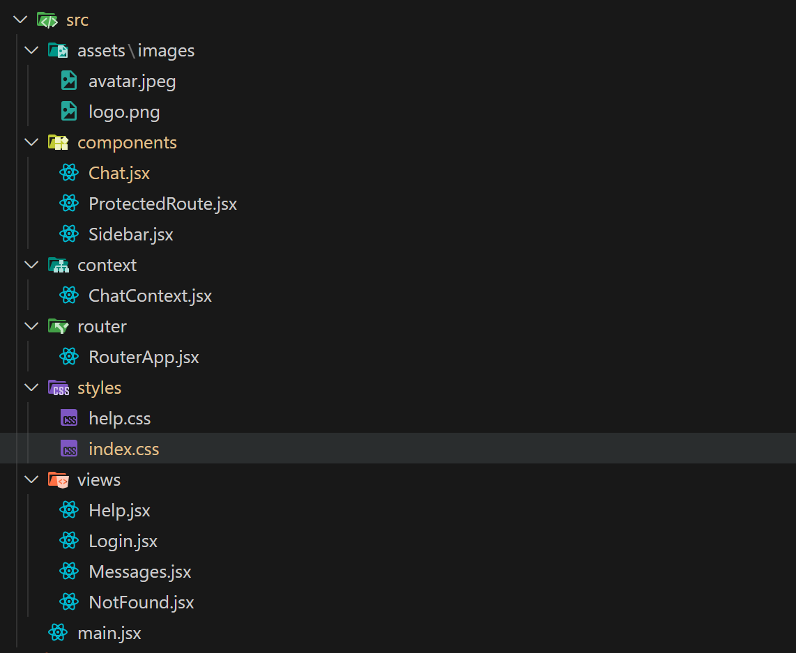

#  ​📱​Clon de WhatsApp - Proyecto Frontend en React

Aplicación web que simula las funciones básicas de WhatsAp: *Login, gestión de contactos y mensajería*. Construída con React y tecnologías modernas del frontend.

## 🚀 Funcionalidades  

✓ Autenticación de usuarios  
✓ Interacción con la lista de usuarios  
✓ Enviar y visualizar mensajes  
✓ Navegación con rutas protegidas  

## 🛠️​Tecnologías utilizadas  

• HTML  
• CSS  
• JavaScript  
• React 
• Vite
• React Router DOM  
• Contexto API  
• Hooks ('useState','useEffect', 'useNavigate')  
• Eventos y formularios  
• Listas e iteración con 'key'  
• JSON  
• Vercel 

## 👤​ Contactos  
• Renderizados como lista dinámica  
• Cada usuario tiene un id, nombre y avatar.    

## 🗨️ Mensajeria  
• Se renderizan en tiempo real en el componente del Chat.  
• Los mensajes se almacenan en estructuras tipo JSON.  
• Cada mensaje contiene: contenido, timestamp.  

## 📏​ Estructura del proyecto
  

## 🚀 Script disponibles  

npm run dev              *Para desarrollo*  
npm run build           *Para compilar*  
npm run lint              *Para revisar el código*  
npm run preview      *Para ver la versión final*  

## ⬇️​ Instalación  
bash  
git clone https://github.com/luisinavinuela/trabajo-final.git  

## 🔒 Rutas protegidas  
Implementadas mediante el componente `ProtectedRoute.jsx`, que verifica si el usuario está autenticado antes de permitir el acceso.  

Redirección automática si el usuario no está autenticado.  

## 🚀 Deployment

Este proyecto está desplegado en [Vercel] https://trabajo-final-coral.vercel.app/chat

## 📄​ Licencia  

Este proyecto fue realizado como parte de un Curso de Programador Web Inicial (Front End Developer) con fines educativos como parte de una evaluación académica.

Luisina Viñuela - Oct/2025

